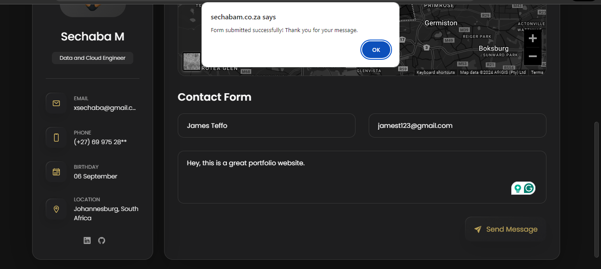

# AWS Integrated Contact Form Demo

## Project Overview

This project demonstrates a contact form integrated with various AWS services to create a serverless architecture. The purpose is to showcase a seamless way of handling form submissions using AWS technologies, ensuring scalability, reliability, and efficiency. This repository is designed as a stand-alone demo to focus on the specific components of this setup, abstracting from the broader context of a full website.

## Technologies Used

- **HTML/CSS/JavaScript**: For the frontend contact form and client-side scripting.
- **AWS Lambda**: Used to process the form submissions.
- **AWS API Gateway**: Manages the HTTP requests between the frontend and Lambda functions.
- **AWS Simple Notification Service (SNS)**: Utilized for sending notifications upon form submissions.
- **Python**: Programming language used for the Lambda function.

## Demo vs. Production Note

This repository serves as a **demo** and instructional guide for setting up a contact form with AWS integration. The actual implementation of this functionality is part of a larger website project. For those interested in the complete website integration and broader application context, please refer to the original website repository: [Original Website Repository](https://github.com/xsechaba/sechabam-portfolio).

## Repository Structure

### `/frontend`
- `index.html`: Demonstrates the HTML setup for the contact form.
- `script.js`: JavaScript for handling the form submission and interaction with AWS API Gateway.

### `/backend`
- `lambda_function.py`: The Lambda function script in Python that processes form data and interacts with SNS.
- `API_Configuration.md`: Documentation detailing how to configure API Gateway and set up CORS properly.

### `/aws_configuration`
- `SNS_Setup.md`: Instructions on setting up Amazon SNS for handling notifications.
- `IAM_Role.md`: Guide on creating and configuring the necessary IAM roles and policies for secure access and operation.

### `/documentation`
- `Setup_Guide.md`: Complete setup guide, from deployment to configuration of each component.
- `Troubleshooting.md`: Troubleshooting document addressing common issues and solutions.

### `/visuals`
- `Screenshots`: Visual aids depicting expected outcomes.

Thank you for visiting this repository. For any further questions or feedback, please open an issue in the GitHub issue tracker.

